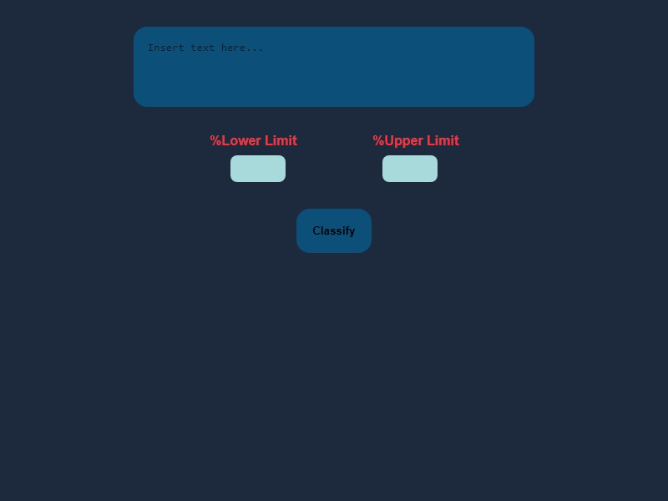

# AIClassify

## Introduction
The project presented aims to demonstrate the Machine Learning model *classification*.
This presentation sees the assignment of Yahoo Answers topics to the input proposed to the AI.
Finally, a CSP problem will be used to possibly filter the assignments made.

## Requirements
- Python installed

## Features
- Classification of Yahoo Answers topics
- In result you obtain the topic of the input with the probability of the result
- You can filter by the probability of the result

## installation
Use the .exe or .msi in the release section

## Screenshots
